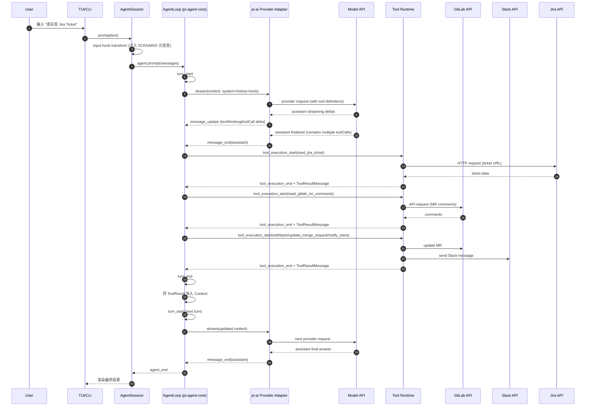
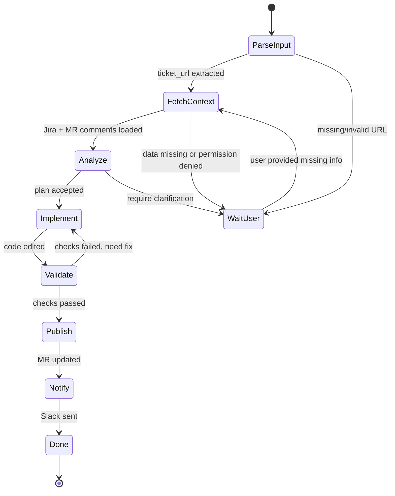

# 例子：在 `pi` 框架里，“Implement Ticket”是怎么跑起来的

这个文档只回答一个问题：

> 用户输入“请实现这个 Jira Ticket”后，Agent 内部到底按什么步骤运行？

假设你已经实现好了相关能力（不管它被组织成 Tool、Skill、Behavior 还是 Scenario）。

---

## 0. 输入

用户在 CLI/TUI 输入：

`请实现这个 Jira Ticket: https://jira.example.com/browse/ABC-123`

---

## 1. 进入会话入口（`AgentSession.prompt`）

- 输入先进入 `AgentSession.prompt(...)`（`packages/coding-agent/src/core/agent-session.ts`）。
- 这里会触发扩展层 `input` 事件（如果有扩展监听），允许：
  - 改写输入
  - 拒绝输入
  - 注入额外上下文

这一步决定“用户话术”变成什么“内部请求”。

---

## 1.5 `input hook` 到底可以做什么（具体假想例子）

在 `pi` 扩展体系里，`input` 事件可以做三类动作：

1. `handled`
- 完全接管这次输入（例如你自己发起一个自定义流程），不再走默认 prompt。

2. `transform`
- 改写用户输入、追加结构化信息或附件，然后继续默认流程。

3. `pass-through`
- 不处理，按原输入继续。

下面是一个“Implement Ticket”的假想 `input hook`：

```ts
pi.on("input", async (event, ctx) => {
  // 只拦截实现 ticket 的请求
  if (!event.text.includes("实现") || !event.text.includes("jira.example.com")) {
    return; // pass-through
  }

  const url = extractJiraUrl(event.text);
  if (!url) return;

  // 改写成结构化执行指令，便于后续稳定路由
  return {
    action: "transform",
    text: [
      "[SCENARIO: implement_ticket]",
      `ticket_url=${url}`,
      "requirements:",
      "- 必须先读取 ticket 和相关 MR 评论",
      "- 修改完成后更新 MR",
      "- 最后发 Slack 通知",
    ].join("\n"),
  };
});
```

这个例子里的重点不是语法，而是：

- 用户说自然语言
- hook 把它转成稳定可编排的“Scenario 输入”
- 后续流程更可控，不依赖一次性 prompt 运气

---

## 2. 命令/模板/技能预处理

- 如果是 `/command`，会先走命令处理路径。
- 普通输入会继续走消息队列。
- 可能触发 skill/template 展开（取决于配置和扩展逻辑）。

最终，系统会形成标准 `user message` 并加入会话状态。

---

## 3. Agent 回合启动（Agent Loop 开始）

- `pi-agent-core` 的循环开始，触发 `agent_start`、`turn_start`。
- `AgentSession` 把这些事件转发给：
  - TUI（显示“正在工作”）
  - Extension 事件处理器（可执行策略逻辑）

---

## 3.5 两种消息队列：`steer` 和 `followUp`

在 Agent 正在运行时，用户新输入不会直接丢失，而是进入队列。框架里有两种队列：

1. `steer` 队列
- 用于“中途纠偏”。
- 会在 Turn 边界和 Tool 执行间隙尽快投递。
- 语义是：尽快让 Agent 转向新指令。

2. `followUp` 队列
- 用于“当前任务结束后的下一条任务”。
- 通常在当前 run 准备结束时才投递。
- 语义是：不打断当前流程，排队到后面。

简化理解：
- `steer` = 中途插话纠偏
- `followUp` = 下一个任务

---

## 4. 构造本轮上下文（`Context`）

发给模型的输入由三部分组成：

1. `system prompt`
2. `message history`（含刚才那条 user message）
3. `active tools`（当前可调用工具清单）

如果你的 Jira 能力是一个 Tool（例如 `read_jira_ticket`），它会在这里被放进工具清单。

---

## 4.5 Active Tools 的 scope 是怎么控制的

这是你关心的关键点：不是把所有 Tool 都发给模型，而是只发当前 `active tools`。

先区分两个集合：

1. `tool registry`
- 系统里“已注册”的全部 Tool（可能很多）。

2. `active tools`
- 当前这次（或当前阶段）允许模型调用的子集。
- 每次 Model request 发出去的是这个子集，不是整个 registry。

### 框架在每次 request 里如何决定发哪些 Tool

在 Agent loop 中，每次 Turn 构造 `Context` 时会读取当前 `context.tools`。  
这个 `context.tools` 就是当前 active set，因此：

- Turn A 可以是 `read-only` 工具集
- Turn B 可以切换到 `edit/write` 工具集
- Turn C 可以只开 `publish/notify` 工具集

也就是说，Tool scope 是“每次请求都重新读取当前 active set”，不是一次固定到底。

### 谁来切换 active set

通常由你的 Extension/Scenario 逻辑在运行时切换，例如：

- 在 `before_agent_start` 按场景初始化工具集
- 在 `tool_result` / `turn_end` 按 phase 迁移切换工具集

示意（伪代码）：

```ts
// phase: fetch_context -> implement -> publish
pi.on("before_agent_start", (_e, ctx) => {
  ctx.setActiveTools(["read_jira_ticket", "read_gitlab_mr_comments", "read", "grep", "find"]);
});

pi.on("turn_end", (_e, ctx) => {
  const phase = getScenarioPhase(ctx);
  if (phase === "implement") {
    ctx.setActiveTools(["read", "grep", "find", "edit", "write", "bash"]);
  } else if (phase === "publish") {
    ctx.setActiveTools(["update_merge_request", "notify_slack", "read"]);
  }
});
```

### 为什么这很重要

如果你把 100 个 Tool 全开：

1. request 里的 tools schema 会显著变大（Context 成本上升）
2. 模型决策噪声变大（更容易选错 Tool）
3. 权限边界变弱（不该调的能力也暴露了）

所以建议是：**最小可用工具集 + 按 phase 动态切换**。

---

## 5. 走 `pi-ai` provider adapter 调模型

- `pi-ai` 根据当前模型/provider 选用适配器（OpenAI/Anthropic/Google 等）。
- 统一 `Context` 被转换成厂商 API 请求。
- 请求里会包含工具定义（name/description/parameters schema）。

这一步是“统一语义 -> 厂商协议”的边界转换。

---

## 6. 流式返回 assistant 事件

模型返回增量事件（例如 text/thinking/toolcall deltas）：

- TUI 通过 `message_update` 实时渲染
- 若模型判断要读取 Jira，会输出 `toolCall`
  - 例如：`read_jira_ticket(url=...)`

---

## 7. 执行工具（Tool Runtime）

runtime 收到 `toolCall` 后：

1. 按工具名在注册表查找实现
2. 调用 `execute(...)`
3. 发送工具执行事件：
   - `tool_execution_start`
   - `tool_execution_update`（可选）
   - `tool_execution_end`

如果工具内部访问 Jira API，错误/超时也会在这一层被包装和上报。

---

## 7.5 一个“多 Tool”的假想执行序列

同一个 `AssistantMessage` 里可能出现多个 `toolCall`，例如：

1. `read_jira_ticket(url)`
2. `read_gitlab_mr_comments(mr_url)`
3. `read(path)` / `grep(pattern)` / `find(pattern)`（本地代码定位）
4. `edit(path, oldText, newText)` / `write(path, content)`
5. `bash(command)`（跑检查、格式化、测试子集）
6. `update_merge_request(mr_id, description)`
7. `notify_slack(channel, text)`

runtime 会逐个执行，结果逐个写成 `ToolResultMessage`，再进入下一 Turn。

---

## 7.6 如果要做 DAG 并行执行：限制、挑战、可行做法

当前默认是“顺序执行”。如果你想把一个 Turn 内的多个 `toolCall` 变成 DAG 并行调度，核心问题不在算法本身，而在依赖语义和执行安全。

### A. 主要限制与挑战

1. 模型通常不提供可靠依赖边
- 大多数 provider 的 `toolCall` 只给“调用和参数”，不稳定提供 `depends_on`。
- 不能把依赖判定完全交给模型。

2. 副作用与资源冲突难题
- `edit/write/update_merge_request/notify_slack` 这类调用有副作用。
- 即使看起来独立，也可能竞争同一资源（同一文件、同一 MR、同一 ticket）。

3. 失败语义会复杂化
- 并行后会出现“部分成功、部分失败”。
- 需要定义：是否回滚？是否重试某一支？是否降级为串行？

4. 观测与调试成本上升
- 顺序日志容易读；并发日志需要 correlation id、span、phase 才能排障。

5. 与 `steer` 中断语义的交互更复杂
- 用户中途插队时，哪些并发任务立即取消，哪些允许收尾，需要清晰策略。

### B. 在 Agent 内部可行的 approach（现阶段）

1. 保守并发（推荐起步）
- 默认串行。
- 只并发 `side_effect_free` 且无资源冲突的 Tool（如 `read/grep/find`）。

2. Tool 元数据驱动调度
- 在 Tool registry 维护调度元数据，例如：
  - `sideEffectFree: boolean`
  - `locks: string[]`（如 `file:src/a.ts`, `mr:123`）
  - `mustSerial: boolean`
- 调度器按锁冲突图决定是否并发。

3. 两阶段执行模型
- 阶段 1：并发收集上下文（read-only tools）。
- 阶段 2：串行执行变更与发布（write/edit/bash/mr/slack）。

4. 失败处理策略先简化
- 并发分支任一失败即收敛到“人工确认或串行重试”，避免早期做自动回滚系统。

5. 保持“Turn 边界不变”
- 即使内部并发，也建议保持：`本 Turn 收集完 toolResults -> 下一 Turn 再喂模型`。
- 这样不破坏现有 Agent loop 语义，改造风险最低。

### C. 实际建议

如果你在转型初期，优先级应是：

1. 先把 Scenario 跑通（顺序执行）  
2. 把 Tool 元数据和日志打好  
3. 只对只读阶段加并发  
4. 最后再评估是否需要完整 DAG

并发是性能优化，不是功能前提。

---

## 8. 回灌 `toolResult` 给模型

工具执行结果不会“直接塞进最终答案”，而是被封装成标准 `toolResult message`，加入会话。

然后 Agent 自动继续下一轮推理：

- 模型读到 Jira 内容后决定下一步
- 可能继续调工具（读 MR、改代码、发 Slack）
- 或直接输出总结

---

## 8.5 结构关系图：`Message`、`AssistantMessage`、`ToolExecutionPhase`、事件流

下面这张图专门回答“对象和事件是什么关系”：

```text
AgentRun {  // 一次完整运行边界：agent_start -> agent_end

  Turn[1] {  // 一次 Model I/O 边界：turn_start -> turn_end

    // ---------------------------
    // 1) Message（数据对象）层
    // ---------------------------
    UserMessage { ... }  // 一个完整 Message object（role=user）

    AssistantMessage {   // 一个完整 Message object（role=assistant）
      content: [text | thinking | toolCall*]
      stopReason: ...
    }

    ToolResultMessage[] {  // 一组完整 Message object（role=toolResult）
      toolCallId: ...
      content: ...
      isError: ...
    }

    // -----------------------------------------
    // 2) Message lifecycle events（事件层）
    // 这些 events 是对上面 Message object 的“生成过程通知”
    // -----------------------------------------

    MessageStart(user)
    MessageEnd(user)

    MessageStart(assistant)
    MessageUpdate(assistant, delta)*   // streaming deltas
    MessageEnd(assistant)              // AssistantMessage finalized

    // ---------------------------------------------------
    // 3) ToolExecutionPhase（runtime 执行层）
    // 触发条件：AssistantMessage.content 里有 toolCall
    // ---------------------------------------------------
    ToolExecutionPhase {

      ToolExecutionStart(toolCall#1)
      ToolExecutionUpdate(toolCall#1, partial)*   // 可选
      ToolExecutionEnd(toolCall#1)

      MessageStart(toolResult#1)
      MessageEnd(toolResult#1)

      ToolExecutionStart(toolCall#2)
      ToolExecutionEnd(toolCall#2)

      MessageStart(toolResult#2)
      MessageEnd(toolResult#2)

      ...
    }

    // Turn 结束时：
    // AssistantMessage（定稿）+ ToolResultMessage[] 会纳入 Context，
    // 下一 Turn 的 Model 输入会读取它们
  }

  Turn[2] { ... }
}
```

一句话关系总结：

1. `AssistantMessage` 是一个 `Message` 对象（数据）。  
2. `MessageStart/Update/End` 是这个对象在 runtime 里的 lifecycle events（过程通知）。  
3. 如果 `AssistantMessage` 里有 `toolCall`，runtime 才进入 `ToolExecutionPhase`，并产出 `ToolResultMessage`。

---

## 8.6 Mermaid 时序图（同一个流程）



---

## 8.65 状态机图（Scenario 级别）



这张图对应的是“Scenario 层”，不是单次 Tool 调用层。  
Tool 是状态迁移的执行手段，状态机才是业务流程骨架。

---

## 8.7 为什么需要 `AssistantMessage`？它不就是模型 response 吗？

短答案：`AssistantMessage` 是“本框架的标准内部对象”，不是“厂商原始 response”。

两者关系是：

1. Model response 是 provider-specific 的
- 不同 provider 返回格式不同，字段名、事件粒度、tool call 表示方式都不同。

2. `AssistantMessage` 是 provider-agnostic 的
- `pi-ai` 先把原始 response 适配、归一化，转换成统一结构的 `AssistantMessage`。

3. 为什么要这层抽象
- 统一跨模型语义：上层不需要为每个 provider 写分支逻辑。
- 支持流式合并：多个 `message_update` 增量最终会定稿为一个完整 `AssistantMessage`。
- 支持持久化与回放：Session 里存的是统一消息对象，不是厂商私有 payload。
- 支持后续决策：runtime 用统一 `AssistantMessage.content` 提取 `toolCall` 并执行。

所以可以这样理解：

- Model response：外部协议数据（输入边界）
- `AssistantMessage`：内部运行时语义对象（核心状态）

它们有关联，但不是同一个层面的概念。

---

## 9. 结束本次回合

当模型不再发 tool call，或触发终止条件（completed/error/aborted）：

- 触发 `turn_end`、`agent_end`
- UI 停止 loading
- 会话状态持久化（可恢复、可回放）

---

## 10. 这条链路中，框架实际提供了什么

这个例子里，`pi` 体系的价值不是“帮你写 Jira API 调用代码”，而是提供了完整运行骨架：

1. 统一消息模型（user/assistant/toolResult）
2. 统一事件流（可观测）
3. 统一 tool-call 执行循环
4. 统一 provider 适配层
5. 会话持久化与恢复
6. 扩展钩子（可插策略和状态机）
7. 中断、重试、错误传播机制

---

## 一句话总结

“Implement Ticket”在 `pi` 里不是一次函数调用，而是一次标准 Agent 回合：

`用户输入 -> 上下文构造 -> 模型决定调 Jira Tool -> 工具执行 -> 结果回灌 -> 模型继续 -> 回合结束`

你实现的是业务能力本身；框架负责让它稳定地跑在可观测、可扩展、可恢复的循环里。
