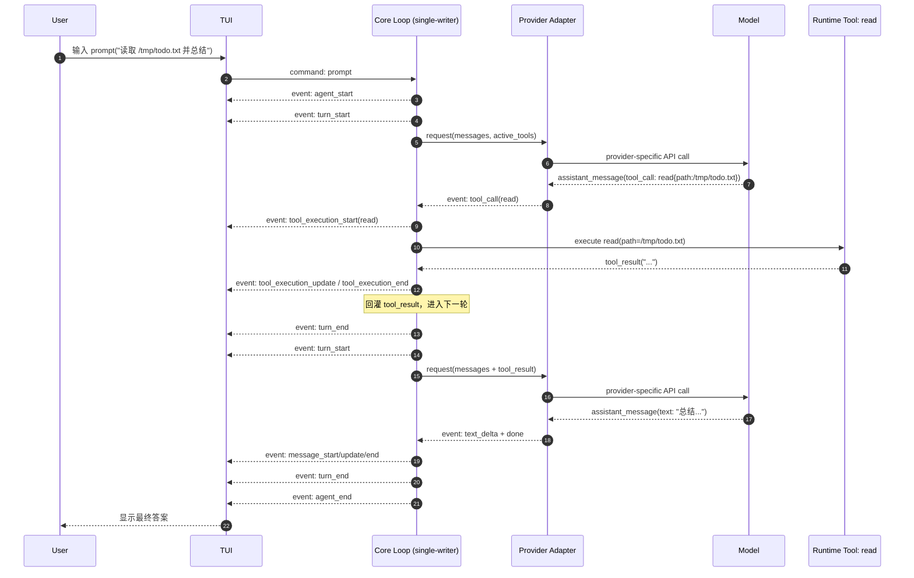

# study-pi: pi-mono Core 设计参考（对 Nous 的映射）

本文聚焦 `pi-mono` 的核心运行语义，作为 `nous` 的设计参考。
覆盖范围：
1. core package 分层职责（`ai` / `agent` / `coding-agent`）
2. `agent_run` / `turn` / `assistant_message` / `tool_call` / `tool_result` 的关系
3. provider adapter 的职责边界
4. 为什么采用事件循环串行推进（而不是并发写核心状态）
5. 两个消息队列的作用（前插纠偏与尾部排队）
6. 一个完整 E2E 执行示例（含 Mermaid 序列图）

## 1) 核心分层（ai / agent / coding-agent）

## `ai` 层
- 目标：统一不同模型厂商协议（OpenAI / Anthropic / Gemini 等）。
- 产出：provider-agnostic 的事件和消息语义（text delta、tool call、done、error）。
- 不做：业务策略与任务编排。

## `agent` 层
- 目标：维护 Agent 运行时语义。
- 关键职责：
  - 维护 run/turn/message 生命周期
  - 执行 tool loop
  - 管理上下文回灌（tool_result -> 下一轮请求）
  - 维护队列与状态机
- 不做：终端 UI 展示。

## `coding-agent` 层
- 目标：CLI/TUI/RPC 交互壳层。
- 关键职责：
  - 接收用户输入（prompt、steer、follow_up、abort）
  - 展示事件流
  - 调用 session/extension/tool 管理接口
- 不做：破坏 core 语义（应是 thin layer）。

## 2) 核心对象关系

1. `agent_run`
- 一次用户请求触发的完整执行过程。
- 边界事件：`agent_start` -> `agent_end`。

2. `turn`
- run 内的一个推理-工具-回灌周期。
- 边界事件：`turn_start` -> `turn_end`。

3. `assistant_message`
- 模型在 turn 中产生的输出。
- 内容可能包含：文本增量 + tool calls。

4. `tool_call`
- assistant_message 中的工具调用意图（工具名 + 参数）。
- core 接到后执行工具，发 `tool_execution_*` 事件。

5. `tool_result`
- 工具执行输出（成功或错误文本）。
- 会被回灌到上下文，进入下一次模型请求。

关系可简化为：
- `agent_run` 包含多个 `turn`
- 每个 `turn` 可能产生一个或多个 `assistant_message`
- `assistant_message` 可包含多个 `tool_call`
- 每个 `tool_call` 产生一个 `tool_result`
- `tool_result` 进入下一个 `turn` 的上下文

## 3) Provider Adapter 做什么

Adapter 只负责“协议归一化”，不负责策略。

输入侧：
- 把内部统一 request（messages/tools/settings）翻译成厂商 API payload。

输出侧：
- 把厂商 response/stream 统一成 agent 可消费事件：
  - text delta
  - tool call
  - done
  - error

好处：
- 上层 loop 不需要知道各厂商字段差异。
- 可以逐步替换 provider，而不重写 core loop。

## 4) 为什么是事件循环串行推进（非并发写核心状态）

核心原因：语义稳定与可观测性。

1. 事件顺序稳定
- run/turn/message/tool 事件必须可重放。

2. 状态一致性
- session、pending queues、active tools 不能被并发 goroutine 打乱。

3. 错误可定位
- 单写者模型更容易定位是哪个 turn 哪个 tool 出错。

并发仍可用于边界 I/O：
- provider 网络调用
- tool 内部 I/O

但这些结果最终必须回到主 loop 串行提交。

## 5) 两个消息队列（语义）

典型会有两类 pending 输入：

1. 前插队列（高优先级纠偏）
- 来源：`steer`
- 语义：尽快影响当前 run 的后续行为。

2. 尾部队列（顺序追加）
- 来源：`follow_up`
- 语义：当前 run 收束后继续处理后续任务。

读取时机（建议与 nous 对齐为固定顺序）：
1. 每轮 `turn_start` 前先检查前插队列（`steer`）。
- 若有内容，优先取出并注入本轮上下文，立即影响当前 run。
2. 当本轮模型输出不再产生 tool calls 时，再检查尾部队列（`follow_up`）。
- 若有内容，取出一条作为下一轮输入，继续当前 `agent_run`。
3. 仅当“无新 tool calls + 两个队列都为空”时，才允许 run 收敛结束。
4. `abort` 到来时，停止后续队列消费，直接进入终止流程。

收敛时必须同时满足：
1. 本轮 assistant 不再产生新的 tool calls
2. 没有 pending messages（包括 steer/follow_up）

## 6) 简单 E2E 示例（从 prompt 到 TUI 展示）

用户输入：
- `prompt "请读取 /tmp/todo.txt 并用一句话总结"`

期望行为：
1. 第 1 轮 assistant 先发起 `read` tool_call。
2. core 执行 read，得到 tool_result。
3. 第 2 轮 assistant 基于 tool_result 生成总结文本。
4. TUI 按事件流显示工具执行与最终答案。

### Mermaid 序列图

## 7) 对 Nous 的直接约束

1. 必须保持 `Core Loop` 单写者推进。
2. 必须保持 `tool_result` 回灌后的多轮收敛。
3. 必须区分 `steer` 与 `follow_up` 队列语义。
4. 必须把 provider 差异封装在 adapter，避免泄漏到 core。
5. TUI 只消费事件，不承载 core 业务逻辑。
